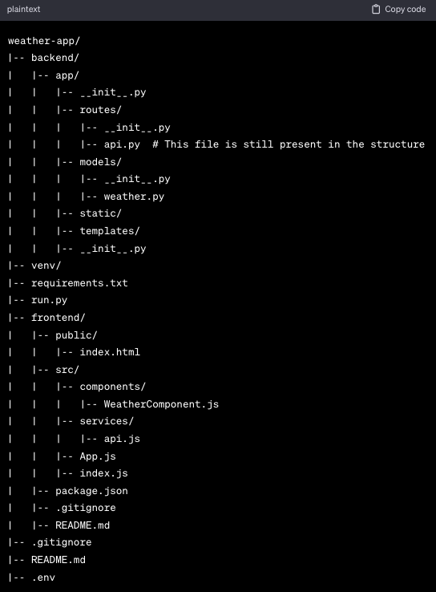

# Women Who Code Challenge

## Two part challenge
### 1. Make daily pushes to Github of weather checking/song playing project
#### a. Incorporate GitHub actions
##### - Including ruff linting, installation of requirements.txt
| Requirements     |        |
| :--------------- |  ----: |
| requests         |  2.27.1 |
| glob2            | 0.7 |
| python-vlc       | 3.0.20123 |
| tinytag          | 1.10.1 |
| ruff             |

### 2. Deploy this weather checking project to a cloud service

Summary of project to include:
- [ ] Deploy to AWS or other cloud service
    - [x] Write small program in Python
    - [ ] Test Python program
    - [ ] Have github actions for project
    - [ ] Include Terraform for deployment
- [ ] More detailed README and documentation
- [x] Visual representation of folder structure 